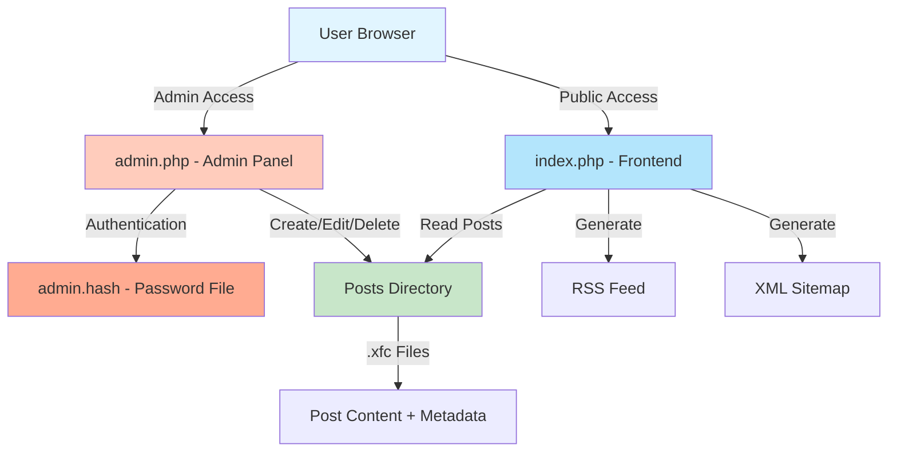
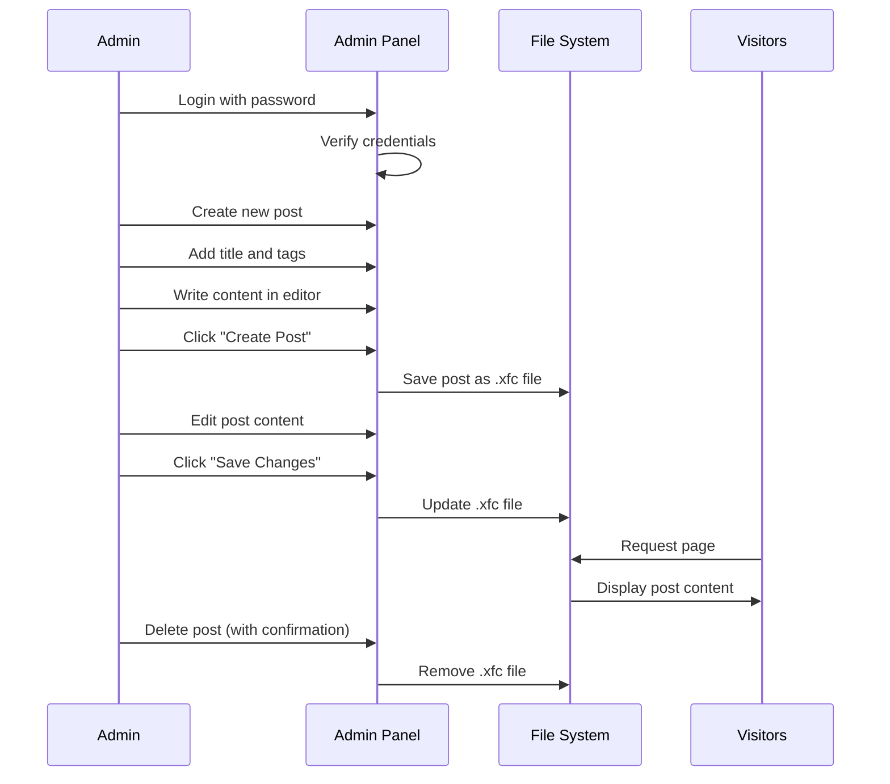
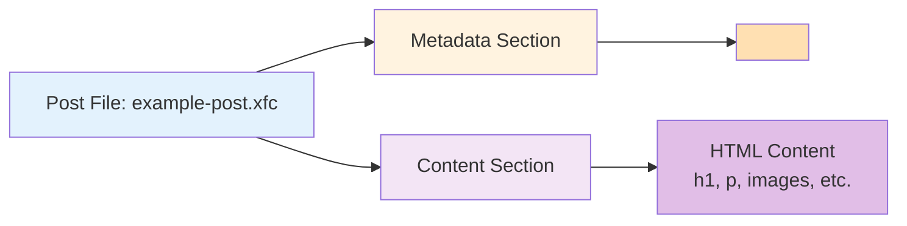

# xsukax Flat-File CMS

A modern, elegant, and secure flat-file content management system designed for professional blogs and personal websites. Built with simplicity, security, and privacy as core principles.

[](https://www.gnu.org/licenses/gpl-3.0)
[](https://www.php.net/)

## 📋 Project Overview

**xsukax Flat-File CMS** is a lightweight, database-free content management system that stores all content as flat files on your server. This architecture eliminates the complexity and security vulnerabilities associated with traditional database-driven systems while providing a fast, reliable platform for publishing content.

The application consists of two primary components:
- **Public Frontend** (`index.php`): A clean, responsive interface for displaying blog posts with tag-based filtering
- **Admin Panel** (`admin.php`): A password-protected dashboard with a WYSIWYG editor for content management

### System Architecture



## 🔒 Security and Privacy Benefits

### Security Features

1. **Password Protection with Strong Hashing**
   - Admin panel protected by bcrypt password hashing (PHP `password_hash()`)
   - Configurable password complexity requirements (minimum 6 characters)
   - Secure password change functionality

2. **CSRF Protection**
   - All administrative actions protected by cryptographically secure CSRF tokens
   - Session-based token validation prevents cross-site request forgery attacks
   - Token regeneration on each session

3. **Path Traversal Prevention**
   - Robust file path validation using `realpath()` and directory boundary checks
   - Prevents malicious attempts to access files outside the Posts directory
   - Sanitized slug generation for all file operations

4. **Session Security**
   - Session ID regeneration on successful login
   - Secure session management with PHP native functions
   - Automatic session destruction on logout

5. **Input Sanitization**
   - All user inputs sanitized before processing
   - HTML special character encoding prevents XSS attacks
   - Strict type declarations (`declare(strict_types=1)`)

6. **File System Security**
   - Restricted file permissions (0664 for posts, 0600 for password file)
   - Posts stored with `.xfc` extension (not directly executable)
   - Directory isolation for content storage

7. **No Database = No SQL Injection**
   - Flat-file architecture eliminates all SQL injection vulnerabilities
   - No database credentials to compromise
   - Reduced attack surface

### Privacy Advantages

1. **Self-Hosted Solution**
   - Complete data sovereignty - you control all your content
   - No third-party services or external dependencies
   - Data never leaves your server

2. **No Tracking or Analytics**
   - Zero built-in tracking mechanisms
   - No cookies except for admin authentication
   - No external API calls or beacons

3. **Minimal Dependencies**
   - Only external resources: Google Fonts and Quill.js editor (both from CDN)
   - Core functionality works offline after initial load
   - No telemetry or usage reporting

4. **Transparent Data Storage**
   - Plain-text files (HTML with metadata comments)
   - Easy to backup, migrate, and audit
   - No proprietary formats or locked-in data

## ✨ Features and Advantages

### Core Functionality

- **📝 WYSIWYG Editor**: Intuitive Quill.js editor with rich formatting options
- **🏷️ Tag-Based Organization**: Flexible content categorization using tags
- **📱 Responsive Design**: Mobile-first design with dark mode support
- **🔍 SEO Friendly**: Automatic sitemap.xml and RSS feed generation
- **⚡ Lightning Fast**: No database queries = instant page loads
- **🎨 Modern UI**: Clean, Apple-inspired interface with smooth animations
- **🔐 Secure Admin Panel**: Password-protected with CSRF protection

### Technical Advantages

- **Zero Configuration**: Drop files on server and run - no complex setup
- **Minimal Server Requirements**: Runs on any PHP 8.0+ hosting
- **Easy Backups**: Copy the Posts directory to backup all content
- **Version Control Friendly**: Text-based storage works perfectly with Git
- **Portable**: Migrate between servers by copying files
- **Resource Efficient**: Minimal CPU and memory footprint
- **No Maintenance**: No database updates or schema migrations

### Content Management

- **Real-time Preview**: View posts as they appear to visitors
- **Draft Management**: Create and edit without immediate publication
- **Bulk Operations**: Manage multiple posts from dashboard
- **Analytics Dashboard**: View post statistics at a glance
- **File Size Tracking**: Monitor content storage usage

## 📦 Installation Instructions

### Prerequisites

- **PHP**: Version 8.0 or higher
- **Web Server**: Apache, Nginx, or similar
- **File Permissions**: Write access to application directory

### Step 1: Download and Extract

```bash
# Clone the repository
git clone https://github.com/xsukax/xsukax-Flat-File-CMS.git

# Navigate to the directory
cd xsukax-Flat-File-CMS
```

### Step 2: Configure Web Server

**For Apache (.htaccess example):**

```apache
<IfModule mod_rewrite.c>
    RewriteEngine On
    RewriteBase /
    
    # Protect admin password file
    <Files "admin.hash">
        Order Allow,Deny
        Deny from all
    </Files>
    
    # Optional: Clean URLs
    RewriteCond %{REQUEST_FILENAME} !-f
    RewriteCond %{REQUEST_FILENAME} !-d
    RewriteRule ^([a-z0-9-]+)$ index.php?p=$1 [L,QSA]
</IfModule>
```

**For Nginx (nginx.conf example):**

```nginx
location / {
    try_files $uri $uri/ /index.php?$query_string;
}

location ~ ^/admin\.hash$ {
    deny all;
}

location ~ \.php$ {
    fastcgi_pass unix:/var/run/php/php8.0-fpm.sock;
    fastcgi_index index.php;
    include fastcgi_params;
}
```

### Step 3: Set File Permissions

```bash
# Make Posts directory writable
chmod 755 Posts/

# Ensure PHP can create admin.hash
chmod 755 .

# After first login, secure the password file
chmod 600 admin.hash
```

### Step 4: Configure Application

Edit the constants in both `index.php` and `admin.php`:

```php
const SITE_URL = 'https://yourdomain.com';  // Your site URL
const SITE_NAME = 'Your Blog Name';         // Site title
const SITE_DESC = 'Your blog description';  // Meta description
```

### Step 5: Access and Secure

1. Open `https://yourdomain.com/admin.php` in your browser
2. Login with default password: `admin123`
3. **IMMEDIATELY** change the password via Settings → Change Password
4. Start creating content!

## 📖 Usage Guide

### Content Workflow



### Creating Your First Post

1. **Access Admin Panel**
   - Navigate to `/admin.php`
   - Enter your password

2. **Create New Post**
   - Click "+ New Post" in the dashboard
   - Enter a descriptive title (e.g., "Welcome to My Blog")
   - Add comma-separated tags (e.g., "welcome, introduction, blog")
   - Click "✓ Create Post"

3. **Edit Content**
   - Use the Quill editor to format your content
   - Add headings, lists, links, and images
   - Utilize the toolbar for formatting:
     - **Headers**: H1, H2, H3
     - **Formatting**: Bold, Italic, Underline, Strike
     - **Lists**: Ordered and Unordered
     - **Media**: Links and Images

4. **Save and Preview**
   - Click "✓ Save Changes" to save
   - Click "👁 Preview" to view as visitors see it
   - Make adjustments as needed

### Managing Existing Posts

**Dashboard Overview:**
- View all posts sorted by date (newest first)
- See post titles, dates, file sizes
- Quick access to Edit, View, and Delete actions

**Editing Posts:**
1. Click "✏️ Edit" on any post
2. Modify content in the WYSIWYG editor
3. Update tags as needed
4. Save changes or preview

**Deleting Posts:**
1. Click "🗑 Delete" on any post
2. Confirm deletion in modal dialog
3. Post is permanently removed

### Tag-Based Filtering

**Frontend (Visitor View):**
- Tags appear as clickable chips on homepage
- Click any tag to filter posts
- Click "All Posts" to reset filter

### RSS and Sitemap

**Automatic Generation:**
- RSS Feed: `https://yourdomain.com/rss.xml`
- Sitemap: `https://yourdomain.com/sitemap.xml`

Both are automatically generated from your posts with no additional configuration required.

### Changing Admin Password

1. Access Admin Panel
2. Click "⚙️ Settings"
3. Enter current password
4. Enter new password (minimum 6 characters)
5. Confirm new password
6. Click "Update Password"

### Data Structure



**Example Post File Structure:**
```html
<!--META
tags: technology, tutorial, php
META-->
<h1>My First Post</h1>
<p>This is the content of my post...</p>
```

## 🛠️ Technical Specifications

### File Structure

```
xsukax-Flat-File-CMS/
├── index.php           # Public frontend
├── admin.php           # Admin panel
├── admin.hash          # Hashed admin password (auto-generated)
└── Posts/              # Content directory
    ├── post-one.xfc
    ├── post-two.xfc
    └── ...
```

### System Requirements

| Component | Requirement |
|-----------|------------|
| PHP Version | 8.0 or higher |
| PHP Extensions | Standard library (no special extensions) |
| Web Server | Apache 2.4+ / Nginx 1.18+ |
| Disk Space | 10 MB + content storage |
| Memory | 64 MB minimum |

### Browser Compatibility

- Chrome/Edge 90+
- Firefox 88+
- Safari 14+
- Mobile browsers (iOS Safari, Chrome Mobile)

## 🔧 Customization

### Styling

Both `index.php` and `admin.php` contain embedded CSS using CSS custom properties (variables). Modify the `:root` section to customize colors:

```css
:root {
    --bg: #ffffff;
    --fg: #1d1d1f;
    --accent: #007aff;
    --card: #f5f5f7;
    --border: #d2d2d7;
}
```

### Adding Custom Fonts

Replace the Google Fonts import in the `<head>` section:

```html
<link href="https://fonts.googleapis.com/css2?family=YourFont:wght@400;500;600;700&display=swap" rel="stylesheet">
```

## 📄 Backup and Migration

### Backup Strategy

**Quick Backup:**
```bash
# Backup all content and configuration
tar -czf xsukax-backup-$(date +%Y%m%d).tar.gz Posts/ admin.hash
```

**Automated Backup (cron example):**
```bash
# Add to crontab for daily backups at 2 AM
0 2 * * * cd /path/to/cms && tar -czf backup-$(date +\%Y\%m\%d).tar.gz Posts/ admin.hash
```

### Migration Steps

1. Backup source installation
2. Transfer `Posts/` directory to new server
3. Transfer `admin.hash` file to preserve password
4. Update `SITE_URL` constant in both PHP files
5. Configure web server on new location

## 🐛 Troubleshooting

### Common Issues

**Issue: Cannot login to admin panel**
- Solution: Delete `admin.hash` file, default password will be `admin123`

**Issue: Posts not saving**
- Solution: Check `Posts/` directory permissions (`chmod 755 Posts/`)

**Issue: 404 errors on posts**
- Solution: Verify web server rewrite rules are configured

**Issue: Changes not appearing**
- Solution: Clear browser cache or use hard refresh (Ctrl+F5)

## 🤝 Contributing

Contributions are welcome! Please feel free to submit pull requests or open issues on GitHub.

### Development Guidelines

1. Maintain PHP 8.0+ compatibility
2. Follow existing code style and structure
3. Test on multiple PHP versions
4. Document new features
5. Preserve security best practices

## 📜 License

This project is licensed under the **GNU General Public License v3.0**.

You are free to:
- Use the software for any purpose
- Study and modify the source code
- Distribute copies of the software
- Distribute modified versions

Under the following terms:
- Source code must be made available when distributing
- Modifications must be released under GPL v3.0
- Changes must be documented
- No warranty is provided

See the [LICENSE](LICENSE) file for complete details, or visit [https://www.gnu.org/licenses/gpl-3.0.html](https://www.gnu.org/licenses/gpl-3.0.html).

## 🙏 Acknowledgments

- **Quill.js** - Modern WYSIWYG editor
- **Google Fonts** - Inter font family
- **PHP Community** - For excellent documentation and tools

## 📧 Support

For issues, questions, or suggestions:
- Open an issue on [GitHub](https://github.com/xsukax/xsukax-Flat-File-CMS/issues)
- Review existing documentation
- Check troubleshooting section

---

**Made with ❤️ for simplicity, security, and privacy**

*Star this repository if you find it useful!*
