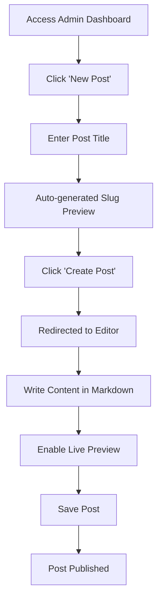
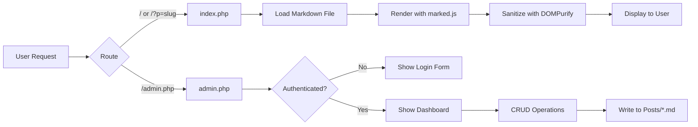

# xsukax Flat-File CMS

A modern, lightweight, and secure flat-file content management system built with PHP. xsukax eliminates database complexity while delivering a professional blogging platform with a clean, intuitive interface and robust security features.

## Project Overview

xsukax is a database-free CMS designed for developers and content creators who value simplicity, security, and performance. The application stores all content as Markdown files in the filesystem, providing version control compatibility and eliminating database dependencies. It features a modern admin dashboard with live Markdown preview, analytics tracking, and a responsive public-facing interface that automatically adapts to light and dark themes.

The system consists of two primary components:
- **Public Interface** (`index.php`) - Renders blog posts with Markdown and Mermaid diagram support
- **Admin Dashboard** (`admin.php`) - Provides authenticated access to post management, editing, and system settings

## Security and Privacy Benefits

xsukax implements multiple layers of security to protect content and administrative access:

### Authentication and Session Security
- **Password Hashing**: Utilizes PHP's `password_hash()` with `PASSWORD_DEFAULT` algorithm (bcrypt) for secure credential storage
- **Session Regeneration**: Implements `session_regenerate_id(true)` on successful authentication to prevent session fixation attacks
- **Secure Session Management**: Stores authentication state in PHP sessions with proper isolation

### Request Protection
- **CSRF Token Validation**: All state-modifying POST requests require valid CSRF tokens to prevent cross-site request forgery attacks
- **Input Sanitization**: The `sanitize_slug()` function ensures all user-supplied slugs contain only safe characters (alphanumeric, hyphens, underscores)
- **HTTP Method Restrictions**: Administrative actions are restricted to POST requests with proper validation

### File System Security
- **Path Traversal Prevention**: The `safe_post_path()` function validates all file paths using `realpath()` to prevent directory traversal attacks
- **Restricted File Permissions**: Password hash file receives `chmod 0600` (owner read/write only), post files receive `chmod 0664`
- **Isolated Storage**: All post content is stored in a dedicated `Posts/` directory with controlled access

### Content Security
- **XSS Prevention**: Integrates DOMPurify for client-side HTML sanitization, preventing malicious script injection in rendered content
- **Output Escaping**: All dynamic content uses `htmlspecialchars()` to prevent HTML injection in server-rendered pages
- **No Database Vulnerabilities**: Elimination of database layer removes SQL injection attack vectors entirely

### Privacy Advantages
- **No External Dependencies for Core Functionality**: User data remains on your server without third-party service integration
- **No User Tracking**: The system does not implement analytics cookies or user tracking mechanisms
- **Minimal Data Exposure**: Only publishes explicitly created content; no metadata leakage beyond file modification timestamps
- **Self-Hosted Control**: Complete ownership and control over all content and user data

## Features and Advantages

### Core Capabilities
- **Database-Free Architecture**: Zero database configuration or maintenance overhead
- **Markdown-Powered**: Write content in Markdown with full GitHub Flavored Markdown support
- **Live Preview Editor**: Real-time Markdown rendering with synchronized scrolling
- **Mermaid Diagram Support**: Native rendering of flowcharts, sequence diagrams, and other visualizations
- **Responsive Design**: Mobile-optimized interface with adaptive layouts
- **Automatic Dark Mode**: System-level theme detection for comfortable viewing in any lighting

### Administrative Features
- **Analytics Dashboard**: Track post counts by day, week, month, and total storage usage
- **Bulk Post Management**: View, edit, and delete posts from centralized dashboard
- **Slug Auto-Generation**: Automatic URL-friendly slug creation from post titles
- **Password Management**: Built-in interface for changing administrative credentials
- **Flash Messaging**: User-friendly feedback for all administrative actions

### Developer Benefits
- **Version Control Friendly**: Plain-text Markdown files integrate seamlessly with Git workflows
- **Minimal Dependencies**: Requires only PHP 7.4+ and a web server
- **Clean Codebase**: Strict type declarations and functional programming patterns
- **Easy Deployment**: Single-file components with no build process
- **Extensible Architecture**: Simple file-based structure facilitates custom modifications

## Installation Instructions

### Prerequisites
- PHP 7.4 or higher with the following extensions:
  - `session` (typically enabled by default)
  - `fileinfo` (typically enabled by default)
- Web server (Apache, Nginx, or similar)
- Write permissions for the application directory

### Installation Steps

1. **Clone the Repository**
   ```bash
   git clone https://github.com/xsukax/xsukax-Flat-File-CMS.git
   cd xsukax-Flat-File-CMS
   ```

2. **Configure Web Server**
   
   **Apache (.htaccess example)**
   ```apache
   <IfModule mod_rewrite.c>
     RewriteEngine On
     RewriteBase /
     RewriteCond %{REQUEST_FILENAME} !-f
     RewriteCond %{REQUEST_FILENAME} !-d
     RewriteRule ^admin$ admin.php [L]
     RewriteRule ^(.*)$ index.php?p=$1 [L,QSA]
   </IfModule>
   ```

   **Nginx Configuration**
   ```nginx
   location / {
     try_files $uri $uri/ /index.php?$query_string;
   }
   
   location /admin {
     try_files $uri /admin.php?$query_string;
   }
   
   location ~ \.php$ {
     fastcgi_pass unix:/var/run/php/php7.4-fpm.sock;
     fastcgi_index index.php;
     include fastcgi_params;
   }
   ```

3. **Set Directory Permissions**
   ```bash
   chmod 755 .
   mkdir -p Posts
   chmod 775 Posts
   ```

4. **Access the Application**
   - Navigate to `https://yourdomain.com/` to view the public site
   - Navigate to `https://yourdomain.com/admin.php` to access the admin dashboard
   - Default credentials: `admin123` (change immediately after first login)

5. **Secure the Installation**
   - Log in to the admin dashboard
   - Navigate to Settings
   - Change the default password to a strong, unique passphrase
   - Ensure the `admin.hash` file has correct permissions (should be set automatically to 0600)

### Optional Enhancements

**Enable HTTPS**: Configure SSL/TLS certificates using Let's Encrypt or your hosting provider
```bash
certbot --nginx -d yourdomain.com
```

**Restrict Admin Access by IP** (Nginx example)
```nginx
location /admin.php {
  allow 192.168.1.0/24;
  deny all;
  include fastcgi_params;
}
```

## Usage Guide

### Creating Your First Post



1. **Access Admin Dashboard**: Navigate to `/admin.php` and authenticate
2. **Create New Post**: Click the "New Post" button in the dashboard header
3. **Enter Title**: Provide a descriptive title (slug generates automatically)
4. **Write Content**: Use the Markdown editor to compose your post
   ```markdown
   # Your Post Title
   
   Introduction paragraph with **bold** and *italic* text.
   
   ## Subheading
   
   - Bullet point 1
   - Bullet point 2
   
   ```code block```
   ```
5. **Enable Live Preview**: Check the "Live Preview" box to see real-time rendering
6. **Save**: Click "Save Post" to publish

### Managing Existing Posts

**Editing Posts**
- Navigate to the dashboard
- Click "Edit" next to the desired post
- Modify content in the Markdown editor
- Click "Save Post" to apply changes

**Deleting Posts**
- Click "Delete" next to the post in the dashboard
- Confirm deletion in the modal dialog
- Post file is permanently removed from the filesystem

**Viewing Post Metadata**
- Posts display modification date, file size, and generated slug
- Dashboard analytics show posting trends over time

### System Architecture



### Administrative Operations

**Changing Password**
1. Click "Settings" in the admin dashboard
2. Enter current password
3. Provide new password (minimum 6 characters)
4. Confirm new password
5. Submit form

**Viewing Analytics**
- Total posts count
- Storage usage across all posts
- Posts created today/this week/this month
- Dashboard updates automatically based on file modification times

### Content Best Practices

**Markdown Features**
- Use single `#` for main title, `##` for sections, `###` for subsections
- Create code blocks with triple backticks
- Add Mermaid diagrams using `mermaid` language identifier
- Tables render automatically with proper styling

**Mermaid Diagram Example**
```markdown
```mermaid
sequenceDiagram
    User->>+Admin: Login Request
    Admin->>+Session: Validate Credentials
    Session-->>-Admin: Auth Token
    Admin-->>-User: Dashboard Access
` ` `
```

### Security Maintenance

**Regular Security Tasks**
- Change admin password every 90 days
- Review `Posts/` directory permissions periodically
- Monitor server logs for unauthorized access attempts
- Keep PHP version updated to receive security patches
- Backup `Posts/` directory and `admin.hash` file regularly

**Backup Procedure**
```bash
# Backup posts and configuration
tar -czf xsukax-backup-$(date +%Y%m%d).tar.gz Posts/ admin.hash

# Restore from backup
tar -xzf xsukax-backup-YYYYMMDD.tar.gz
```

## System Requirements

| Component | Requirement |
|-----------|-------------|
| PHP | 7.4 or higher |
| Web Server | Apache 2.4+, Nginx 1.18+, or equivalent |
| Disk Space | 10MB + content storage |
| RAM | 64MB minimum (shared hosting compatible) |
| Browser (Admin) | Modern browser with JavaScript enabled |

## Troubleshooting

**Issue**: Cannot create posts
- **Solution**: Verify `Posts/` directory exists and has write permissions (775)

**Issue**: Admin login fails with correct password
- **Solution**: Clear browser cookies and PHP sessions, then retry

**Issue**: Posts not displaying on homepage
- **Solution**: Check that `.md` files exist in `Posts/` directory with proper permissions (644)

**Issue**: Live preview not working
- **Solution**: Verify JavaScript is enabled and CDN resources (marked.js, DOMPurify) are accessible

## License

This project is licensed under the **GNU General Public License v3.0**.

You are free to use, modify, and distribute this software under the terms of the GPLv3. Any derivative works must also be licensed under GPLv3. For complete license terms, see the [LICENSE](LICENSE) file or visit [https://www.gnu.org/licenses/gpl-3.0.en.html](https://www.gnu.org/licenses/gpl-3.0.en.html).

### Key License Terms
- **Freedom to Use**: Run the program for any purpose
- **Freedom to Study**: Access and modify source code
- **Freedom to Distribute**: Share copies with others
- **Freedom to Improve**: Distribute modified versions
- **Copyleft**: Derivative works must use GPLv3

## Contributing

Contributions are welcome. Please submit pull requests to the repository with clear descriptions of changes and any relevant test cases.

## Support

For bug reports and feature requests, please open an issue on the GitHub repository: [xsukax/xsukax-Flat-File-CMS](https://github.com/xsukax/xsukax-Flat-File-CMS)

---

**xsukax Flat-File CMS** - Simple. Secure. Elegant.
