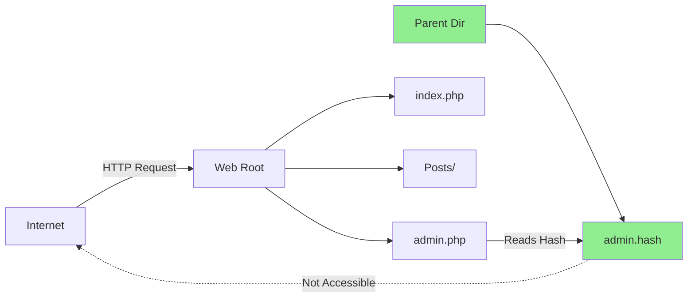
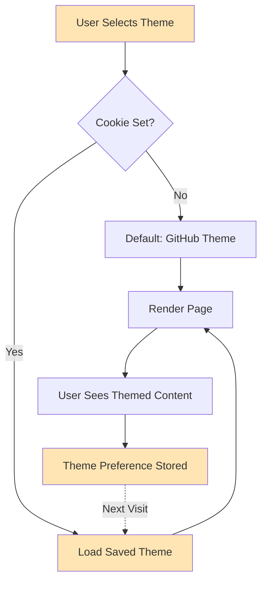
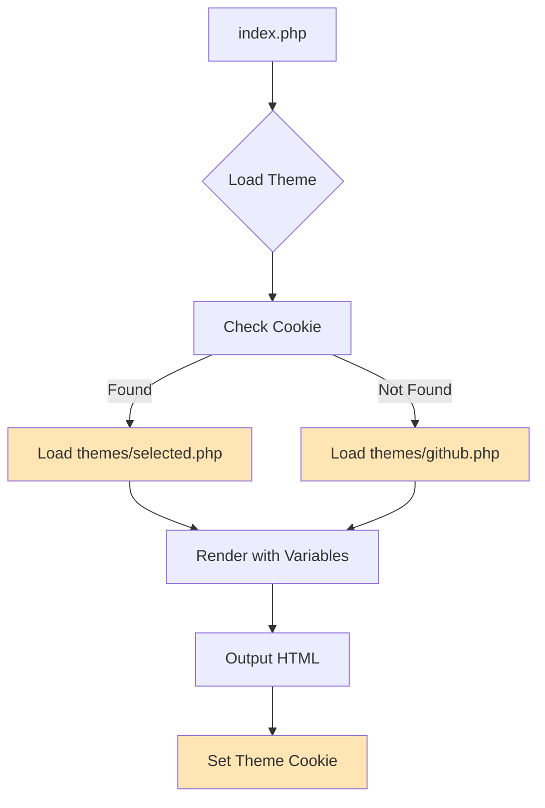
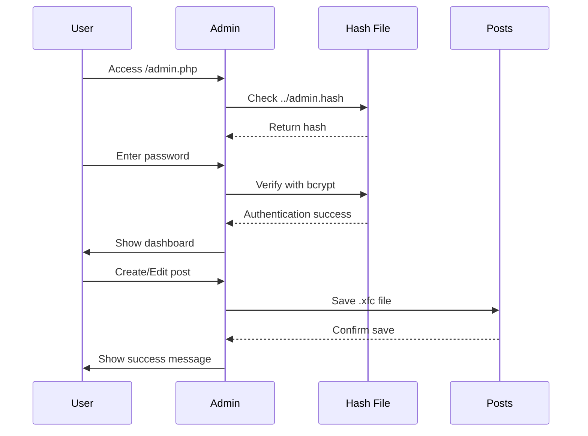
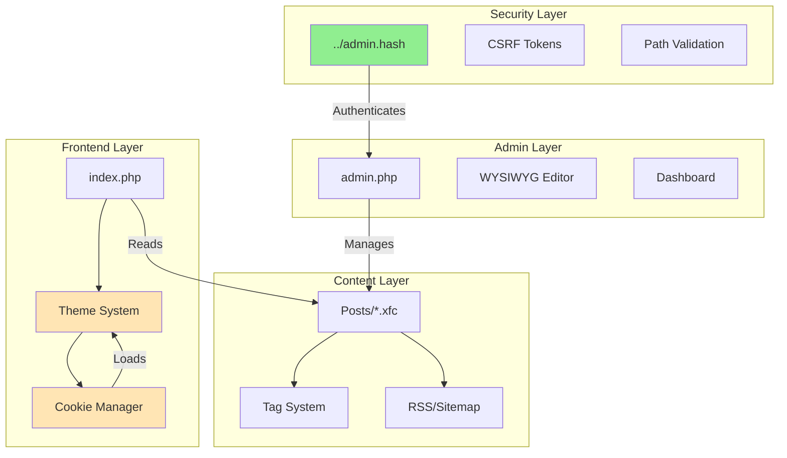

# xsukax Flat-File CMS

A secure, themeable flat-file content management system. No database required.

## Overview

xsukax combines enterprise-grade security with flexible theming in a lightweight PHP-based CMS. Features external password storage and dynamic theme switching without any database dependencies.

## Core Features

### 🔒 External Password Storage

Password hash stored in `../admin.hash` - **outside the web root** - providing multiple layers of security:

- **Inaccessible via HTTP**: Cannot be downloaded through web requests
- **Path Traversal Protection**: Isolated from application directory
- **Permission Isolation**: Independent file permissions from web files
- **Security by Design**: Follows OWASP best practices for credential storage



### 🎨 Multi-Theme Support

Dynamic theme switching system with user preferences:

- **Cookie-Based Selection**: Theme choice persists across sessions
- **No Page Reload**: Instant theme application
- **Zero Configuration**: New themes auto-detected
- **Template Inheritance**: All themes share core functionality
- **User Control**: Frontend theme selector for visitors



## Additional Features

- **Zero Dependencies**: No database installation required
- **WYSIWYG Editor**: Quill-based rich text editing
- **Tag System**: Flexible content categorization
- **SEO Optimized**: Auto-generated RSS feeds and sitemaps
- **CSRF Protection**: Token-based security on all forms
- **Path Sanitization**: Prevents directory traversal attacks
- **Mobile Responsive**: All themes mobile-first
- **Analytics Dashboard**: Content metrics and insights

## Requirements

- PHP 7.4 or higher
- Web server (Apache/Nginx)
- Write permissions for Posts directory

## Installation

1. Clone the repository:
```bash
git clone https://github.com/xsukax/xsukax-Flat-File-CMS.git
```

2. **Configure web root correctly**:
```
/var/www/
├── admin.hash          # SECURE: Outside web root
└── html/               # WEB ROOT: Server points here
    ├── admin.php
    ├── index.php
    ├── Posts/
    └── themes/
        └── github.php
```

3. Set permissions:
```bash
chmod 755 html/
chmod 775 html/Posts/
chmod 600 ../admin.hash
```

4. Update configuration in `index.php`:
```php
const SITE_URL = 'https://yourdomain.com';
const SITE_NAME = 'Your Site Name';
const SITE_DESC = 'Your description';
```

5. Access `/admin.php` - default password: `admin123`
6. **Change password immediately** via Settings

## Creating Custom Themes

Themes are PHP templates in the `/themes/` directory. To create a new theme:

1. Create a new file: `themes/mytheme.php`
2. Use available variables:
```php
$pageTitle       // Page title
$is_home         // Boolean: homepage or single post
$posts           // Array of posts (homepage)
$content         // Post content (single post)
$postMeta        // Post metadata including tags
$allTags         // All available tags
$currentTheme    // Active theme name
$availableThemes // All installed themes
```

3. Theme structure example:
```php
<!DOCTYPE html>
<html>
<head>
    <title><?=htmlspecialchars($pageTitle)?></title>
    <style>
        /* Your theme styles */
    </style>
</head>
<body>
    <?php if($is_home): ?>
        <!-- Homepage layout -->
        <?php foreach($posts as $post): ?>
            <!-- Post listing -->
        <?php endforeach; ?>
    <?php else: ?>
        <!-- Single post layout -->
        <?=$content?>
    <?php endif; ?>
    
    <!-- Theme selector -->
    <form method="post">
        <select name="theme">
            <?php foreach($availableThemes as $slug => $name): ?>
                <option value="<?=$slug?>" 
                    <?=$slug === $currentTheme ? 'selected' : ''?>>
                    <?=$name?>
                </option>
            <?php endforeach; ?>
        </select>
        <button name="change_theme">Apply</button>
    </form>
</body>
</html>
```

4. Theme automatically appears in selector
5. No server restart required

### Theme Architecture



## Usage

### Admin Panel Workflow



### Content Management

1. **Create Post**: Title → Auto-generate slug → Add tags → Edit content
2. **Edit Post**: Select from dashboard → WYSIWYG editor → Save
3. **Delete Post**: Confirmation modal → Permanent deletion
4. **Tag Management**: Select existing or create new tags

### Theme Management

1. **Switch Theme**: Footer selector → Choose theme → Submit
2. **Cookie Stored**: 365-day expiration
3. **Instant Apply**: No cache clearing required

## Directory Structure

```
project-root/
├── admin.hash              # Password (OUTSIDE web root)
└── public/                 # Web server document root
    ├── admin.php           # Admin interface
    ├── index.php           # Frontend controller
    ├── Posts/              # Content storage (.xfc files)
    └── themes/             # Theme templates
        ├── github.php      # Default theme (GitHub-style)
        └── custom.php      # Your custom themes
```

## Security Configuration

### Apache (.htaccess)

```apache
# Restrict admin access by IP
<Files "admin.php">
    Order Deny,Allow
    Deny from all
    Allow from 192.168.1.0/24
</Files>

# Prevent .xfc downloads
<FilesMatch "\.xfc$">
    Order Allow,Deny
    Deny from all
</FilesMatch>

# Protect admin.hash (redundant but safe)
<Files "admin.hash">
    Order Allow,Deny
    Deny from all
</Files>
```

### Nginx

```nginx
location ~ /admin\.php$ {
    allow 192.168.1.0/24;
    deny all;
}

location ~* \.xfc$ {
    deny all;
}

location ~ /admin\.hash$ {
    deny all;
}
```

## Configuration Options

### Core Settings (index.php)

```php
const POSTS_DIR = __DIR__ . '/Posts';
const THEMES_DIR = __DIR__ . '/themes';
const SITE_URL = 'https://yourdomain.com';
const SITE_NAME = 'Your Site Name';
const SITE_DESC = 'Site description';
const POSTS_PER_PAGE = 12;
```

### Admin Settings (admin.php)

```php
const POSTS_DIR = __DIR__ . '/Posts';
const ADMIN_FILE = '../admin.hash';  // Outside web root
const SITE_URL = 'https://yourdomain.com';
```

## Production Checklist

- [ ] Verify `admin.hash` is outside web root
- [ ] Change default password immediately
- [ ] Enable HTTPS/SSL
- [ ] Restrict admin.php by IP address
- [ ] Set file permissions: 600 for admin.hash, 644 for .php files
- [ ] Test theme switching functionality
- [ ] Configure automatic backups for Posts directory
- [ ] Disable PHP error display in production
- [ ] Test RSS and sitemap generation

## Architecture Overview



## License

GNU General Public License v3.0. See [LICENSE](LICENSE) for details.

## Contributing

Contributions welcome. Please maintain:
- External password hash storage architecture
- Theme system compatibility
- Security features and CSRF protection

## Support

Issues and feature requests: [GitHub Issues](https://github.com/xsukax/xsukax-Flat-File-CMS/issues)

---

**Design Philosophy**: Security and flexibility are not mutually exclusive. This CMS proves both can coexist in a simple, maintainable package.
