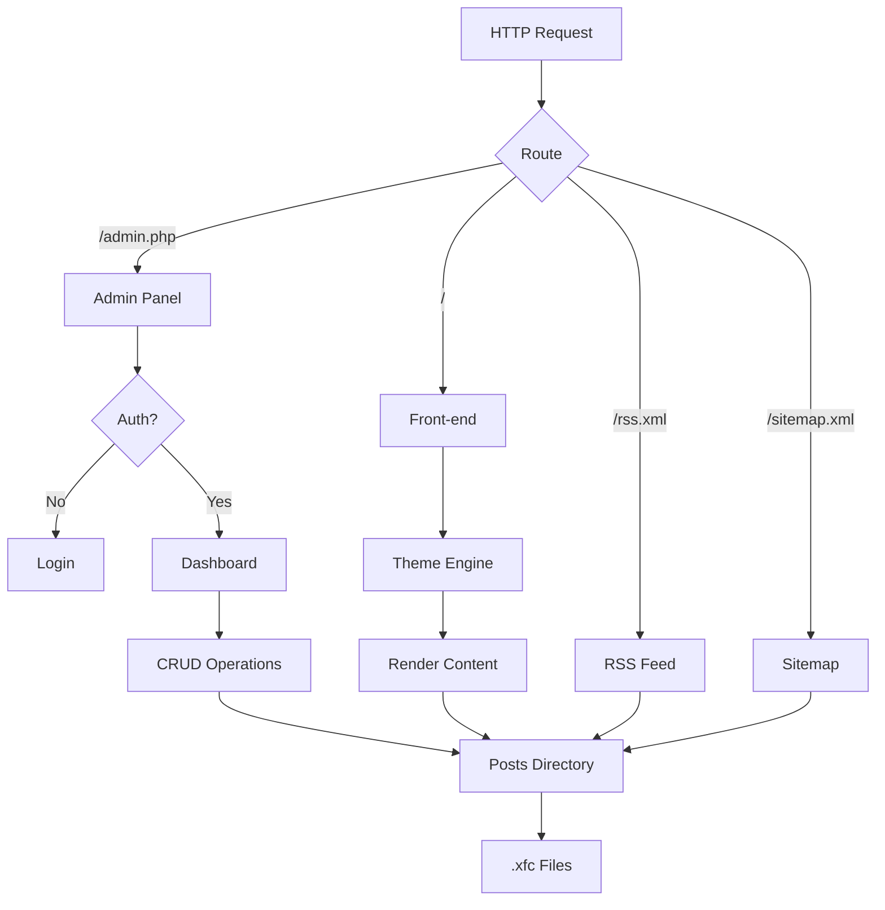
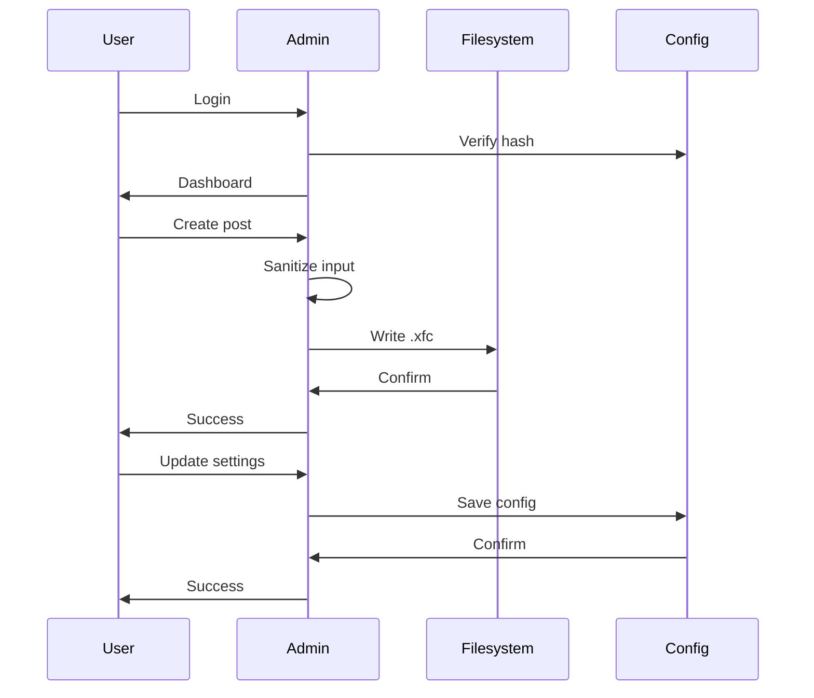

# xsukax Flat-File CMS

A secure, database-free content management system built with PHP. Zero dependencies, maximum simplicity.

[](https://www.gnu.org/licenses/gpl-3.0)
[](https://www.php.net/)


## Overview

xsukax is a lightweight flat-file CMS that eliminates database overhead while maintaining full CMS functionality. Content is stored in plain `.xfc` files with embedded metadata, making it portable, version-control friendly, and simple to backup.

**Core Features:**
- Admin dashboard with analytics and WYSIWYG editor (Quill.js)
- Full-text search across posts
- Five professional themes (GitHub, Terminal, IMDb, Bluey, Dark-Grey)
- Automatic RSS feed and sitemap generation
- Tag-based organization with random discovery
- Responsive design across all themes

## Security & Privacy

### Security Architecture

**Authentication:**
- Bcrypt password hashing with `PASSWORD_DEFAULT`
- Session regeneration on login
- CSRF protection on all state-changing operations
- Configurable minimum 6-character password

**Input Protection:**
- Path traversal prevention via realpath validation
- Comprehensive slug sanitization
- HTML escaping on all output
- Safe file operations with exclusive locks

**File Security:**
- Restrictive permissions (0664 posts, 0600 config)
- Atomic writes with `LOCK_EX`
- No dynamic code execution

**Attack Surface:**
- Zero SQL injection vectors (no database)
- Minimal external dependencies (CDN only)
- Error display disabled by default

### Privacy

- No analytics or tracking
- No external API calls (except CDN fonts)
- Local-only data storage
- Human-readable file format
- Minimal cookie usage (session + theme)

## Features

### Content Management
- Rich WYSIWYG editor with formatting, images, code blocks
- Tag system with bulk operations
- Creation date preservation
- Draft preview before publishing

### User Experience
- Configurable pagination (default: 12 posts/page)
- Real-time search with result highlighting
- Dynamic tag filtering (20 random tags displayed)
- One-click code copying
- Instant theme switching

### Administration
- Dashboard analytics: Total, Today, Last 7 Days, Last 30 Days
- Settings management: URL, name, description, posts per page
- Post management: Paginated listing with inline actions
- Password management through UI

### Developer Benefits
- Portable: Copy files to migrate
- Version-control friendly: Plain text storage
- Simple backups: No database dumps
- Extensible: Easy theme creation
- Debuggable: Readable file format

## Installation

### Requirements

- PHP 7.4+
- Apache/Nginx
- Standard PHP extensions (no extras)

### Setup

**1. Clone Repository**
```bash
git clone https://github.com/xsukax/xsukax-Flat-File-CMS.git
cd xsukax-Flat-File-CMS
```

**2. Configure Server**

**Apache (.htaccess)**
```apache
RewriteEngine On
RewriteCond %{REQUEST_FILENAME} !-f
RewriteCond %{REQUEST_FILENAME} !-d
RewriteRule ^(.*)$ index.php [QSA,L]
```

**Nginx**
```nginx
location / {
    try_files $uri $uri/ /index.php?$query_string;
}
```

**3. Set Permissions**
```bash
chmod 755 . Posts/ themes/
chmod 644 *.php
```

**4. Initial Login**
- Navigate to `https://yourdomain.com/admin.php`
- Default password: `admin123`
- **Change immediately** in Settings → Change Password

**5. Configure Site**
- Settings → Update Site URL, Name, Description
- Save configuration

### Directory Structure

```
xsukax-Flat-File-CMS/
├── admin.php              # Admin panel
├── index.php              # Front-end
├── Posts/                 # Post storage (auto-created)
├── themes/                # Theme templates
│   ├── github.php
│   ├── terminal.php
│   ├── imdb.php
│   ├── bluey.php
│   └── dark-grey.php
└── ../config.php          # Config + admin hash (auto-created)
```

## Usage

### System Architecture



### Content Workflow



### Creating Posts

1. **Admin Panel**: Login at `/admin.php`
2. **New Post**: Click "New post"
3. **Title**: Enter title (auto-generates slug)
4. **Tags**: Select existing or add new (comma-separated)
5. **Content**: Use WYSIWYG editor
6. **Save**: Creates `.xfc` file in `Posts/`

### Managing Settings

**Via Settings Panel:**
- Site URL: Full URL with protocol
- Site Name: Appears in headers
- Site Description: SEO meta description
- Posts Per Page: 1-100 (default: 12)

**Password Change:**
- Current password required
- Minimum 6 characters
- Confirmation match required

### Post File Format

```html
<!--META
tags: php, cms, tutorial
created: 1696118400
META-->
<h1>Post Title</h1>
<p>Content here...</p>
```

### Theme Development

Themes access these variables:
```php
$is_home       // Boolean: homepage check
$posts         // Array: paginated posts
$content       // String: rendered HTML
$allTags       // Array: unique tags (shuffled)
$search        // String: search query
$page          // Integer: current page
$totalPages    // Integer: pagination
```

**Minimal Theme Template:**
```php
<!DOCTYPE html>
<html>
<head>
    <title><?=htmlspecialchars($pageTitle)?></title>
</head>
<body>
    <?php if($is_home): ?>
        <!-- Post listing -->
    <?php else: ?>
        <!-- Single post -->
    <?php endif; ?>
</body>
</html>
```

### Search

**Front-end:** `?s=query`  
**With filters:** `?s=query&tag=tagname&page=2`  
Searches titles and full content (case-insensitive)

### Backup

**Manual:**
```bash
tar -czf backup-$(date +%Y%m%d).tar.gz Posts/ ../config.php
```

**Automated (Cron):**
```bash
0 2 * * * cd /path && tar -czf backups/$(date +\%Y\%m\%d).tar.gz Posts/ ../config.php
```

### Troubleshooting

| Issue | Solution |
|-------|----------|
| 404 on admin | Check file permissions (644) |
| Can't save posts | Verify Posts/ writable (755) |
| Config not saving | Parent directory must be writable |
| Lost password | Delete config.php, resets to `admin123` |
| Themes not loading | Ensure themes/*.php exist |

## Security Hardening

### Production Checklist
- [ ] Change default password
- [ ] Set config.php to 0600 permissions
- [ ] Enable HTTPS
- [ ] Add security headers (CSP, X-Frame-Options)
- [ ] Regular PHP updates
- [ ] Implement rate limiting
- [ ] Monitor Posts/ directory

### Server Configuration

**Apache (.htaccess)**
```apache
<FilesMatch "^config\.php$">
    Require all denied
</FilesMatch>

Header set X-Content-Type-Options "nosniff"
Header set X-Frame-Options "SAMEORIGIN"
Header set X-XSS-Protection "1; mode=block"
```

**Nginx**
```nginx
location ~ ^/config\.php$ {
    deny all;
    return 404;
}

add_header X-Content-Type-Options "nosniff";
add_header X-Frame-Options "SAMEORIGIN";
add_header X-XSS-Protection "1; mode=block";
```

## Contributing

1. Fork repository
2. Create feature branch
3. Follow PSR-12 standards
4. Test on PHP 7.4, 8.0, 8.1, 8.2
5. Submit pull request

## License

Licensed under **GNU General Public License v3.0**

**Permissions:**
- Commercial use
- Modification
- Distribution
- Private use

**Conditions:**
- Disclose source
- License and copyright notice
- State changes
- Same license

See [LICENSE](LICENSE) or https://www.gnu.org/licenses/gpl-3.0.html

## Support

- **Issues**: [GitHub Issues](https://github.com/xsukax/xsukax-Flat-File-CMS/issues)
- **Discussions**: [GitHub Discussions](https://github.com/xsukax/xsukax-Flat-File-CMS/discussions)

---

**Built for security, simplicity, and speed.**
